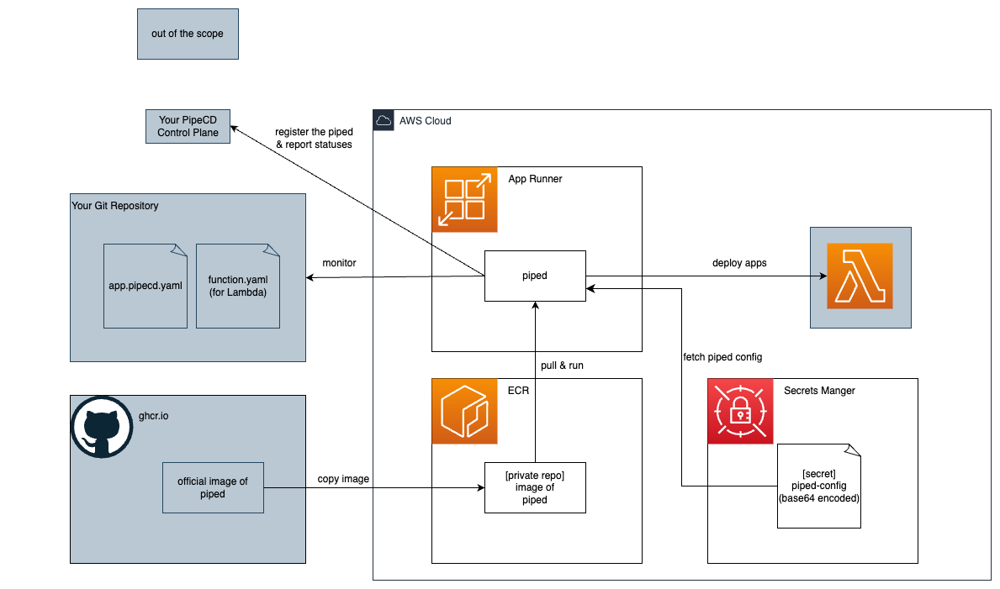

# Running a piped on AWS App Runner

## Overview



- **NOTE: The version of piped must be >=v0.46.1-rc0 because https://github.com/pipe-cd/pipecd/pull/4785 is required.**
- You can also deploy apps to ECS. See [iam.tf](./terraform/iam.tf).
- In this template, the image is PipeCD's `launcher`. So you can [update the piped via your PipeCD's Web Console](https://pipecd.dev/docs/user-guide/managing-piped/remote-upgrade-remote-config/)

## Prerequisites

- You have PipeCD's Control Plane.
- You have a piped config file.
- (Optional) You have app.pipecd.yaml and other application config files.
- Run Docker where you execute the IaC commands.

## Usage > by [Terraform](./terraform/)

1. Create your .tfvars file. All required variables are defined in [variables.tf](./terraform/variables.tf).
2. Deploy 
    ```bash
    sh apply.sh <YOUR_TFVARS_FILE_PATH>
    ```
