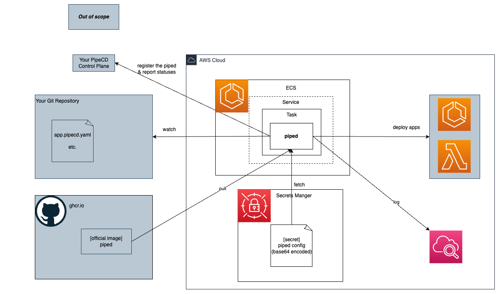

# Running a piped on Amazon ECS

You will install a piped as an ECS Service Task.

## Architecture Overview



## Prerequisites

- You have PipeCD's Control Plane.
- You have a piped config file.
- (Optional) You have app.pipecd.yaml and other application config files.

## Usage (Terraform)

1. Create your `.tfvars` file. All required variables are defined in [variables.tf](./terraform/variables.tf).
2. Apply
    ```bash
    terraform apply-var-file=YOUR.tfvars
    ```

## See Also

- [Docs > Installing on ECS Fargate](https://pipecd.dev/docs/installation/install-piped/installing-on-fargate/)
